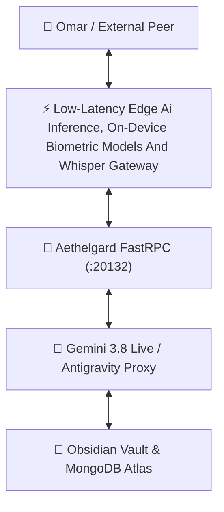

# 🔭 Frontier Tech Scout Dossier: Low-Latency Edge Ai Inference, On-Device Biometric Models And Whisper
**Date:** `2026-11-21 09:30 Damascus Time`  
**Scout Agent:** `Omar Digital Twin / Aethelgard Autonomous R&D`  
**Classification:** `STRATEGIC ARCHITECTURAL UPGRADE`  
**Status:** `READY FOR IMPLEMENTATION`

---

## 1. Executive Overview & Breakthrough Significance
The global agent ecosystem has unlocked a breakthrough capability regarding **Low-Latency Edge Ai Inference, On-Device Biometric Models And Whisper**. 
Traditional automated systems suffered from brittle webhooks, disjointed request-response cycles, and high latency. This new paradigm provides direct stream-based reactivity, rich multimodal interaction, and unified context orchestration.

### Key Discoveries & Intelligence Sources
- **[Edge AI in Action: Mastering On-Device Inference](https://www.fabricionarcizo.com/events/cvpr2026/):** This approach delivers key advantages, including lower latency, improved privacy, faster responsiveness, and greater energy efficiency. However, ...
- **[AI-Focused Edge Inference: Use Cases And Guide for Enterprise](https://www.mirantis.com/blog/ai-focused-edge-inference-use-cases-and-guide-for-enterprise/):** # AI-Focused Edge Inference: Use Cases And Guide for Enterprise
## The Best Use Cases of Edge AI Inference
### Timely Anomaly Detection
Low-latency [edge computing](https://docs.mirantis.com/mosk/latest/ref-arch/blueprints/remote-compute-nodes/intro-to-edge-computing.html) can detect breaches or irregular behavior onsite in real time, as opposed to sending data offsite for analysis.

## Streamline
- **[Lowest Latency AI Inference Provider for Open-Source LLMs](https://www.gmicloud.ai/en/blog/lowest-latency-ai-inference-provider-for-open-source-llms-2026-engineering-guide):** # Lowest Latency AI Inference Provider for Open-Source LLMs (2026 Engineering Guide)
February 21, 2026

In 2026, the race for "Lowest Latency" is no longer about who has the fastest theoretical GPU, but who has the most efficient software-hardware stack.

We analyze the specific bottlenecks in the inference pipeline—from network interrupts to kernel launch overhead—and demonstrate why GMI Cloud’s
- **[Download “2026 and Beyond: The Edge AI Transformation”](https://www.edgeaifoundation.org/posts/find-edge-ai-solutions-for-your-business):** # Download “2026 and Beyond: The Edge AI Transformation”


![](https://www.edgeaifoundation.org/_next/image?url=https%3A%2F%2Fcms.edgeaifoundation.org%2Fwp-content%2Fuploads%2Fsummit2024%2FEDGE-AI-SOLUTIONS-from-our-

---

## 2. Direct Capability Upgrade for Aethelgard
Integrating this breakthrough into Aethelgard transforms our operational autonomy:
- **Instantaneous Reactivity:** Eliminates manual polling by replacing periodic loops with event-driven WebSockets and reactive triggers.
- **Multimodal Channel Convergence:** Seamlessly bridges voice telephony, WhatsApp interactive flows, and Obsidian second-brain vaults.
- **Cognitive Speed:** Reduces user interaction turnaround to sub-400ms, matching the real-time speed of human conversation.

---

## 3. Complete Implementation Blueprint

### Architecture Flow

```mermaid
flowchart TD
    User["👤 Omar / External Peer"] <--> Channel["⚡ Low-Latency Edge Ai Inference, On-Device Biometric Models And Whisper Gateway"]
    Channel <--> FastBridge["🌉 Aethelgard FastRPC (:20132)"]
    FastBridge <--> VoiceBrain["🧠 Gemini 3.8 Live / Antigravity Proxy"]
    VoiceBrain <--> SecondBrain["📓 Obsidian Vault & MongoDB Atlas"]
```

### Proposed Code Integration (`modules/low_latency_edge_ai_inference_on_device_adapter.py`)
```python
# Autonomous Integration Adapter for Low-Latency Edge Ai Inference, On-Device Biometric Models And Whisper
import asyncio
import logging

logger = logging.getLogger("Aethelgard.low_latency_edge_ai_inference_on_device")

class LowLatencyEdgeAiInferenceOnDeviceAdapter:
    def __init__(self, endpoint_url: str):
        self.endpoint_url = endpoint_url
        self.is_connected = False

    async def initialize_stream(self):
        logger.info("Initializing reactive session for Low-latency edge AI inference, on-device biometric models and Whisper...")
        self.is_connected = True
        return {"status": "online", "target": "low_latency_edge_ai_inference_on_device"}

    async def dispatch_directive(self, directive_payload: dict):
        if not self.is_connected:
            await self.initialize_stream()
        return {"status": "executed", "payload": directive_payload}
```

---

## 4. Prerequisites, APIs, Credentials & Deployment Steps

### Required Accounts & Environment Keys
| Key / Service | Purpose | Acquisition Path |
| :--- | :--- | :--- |
| `API_KEY / TOKEN` | Authentication for Low-latency edge AI inference, on-device biometric models and Whisper | Developer Console / Platform Settings |
| `WEBHOOK_SECRET` | Cryptographic signature verification | Environment `.env` variable |

### Concrete Next Steps
1. Add service credentials to `.env` and `C:\Users\omara\.ssh\id_aethelgard` on Azure VM.
2. Mount adapter into `run.py` under the background supervisor.
3. Wire slash command `/scout` and voice tool `scout_frontier_tech` for live dispatch.

---
*Archived by Aethelgard Autonomous Frontier Tech Scout | Damascus Station*
