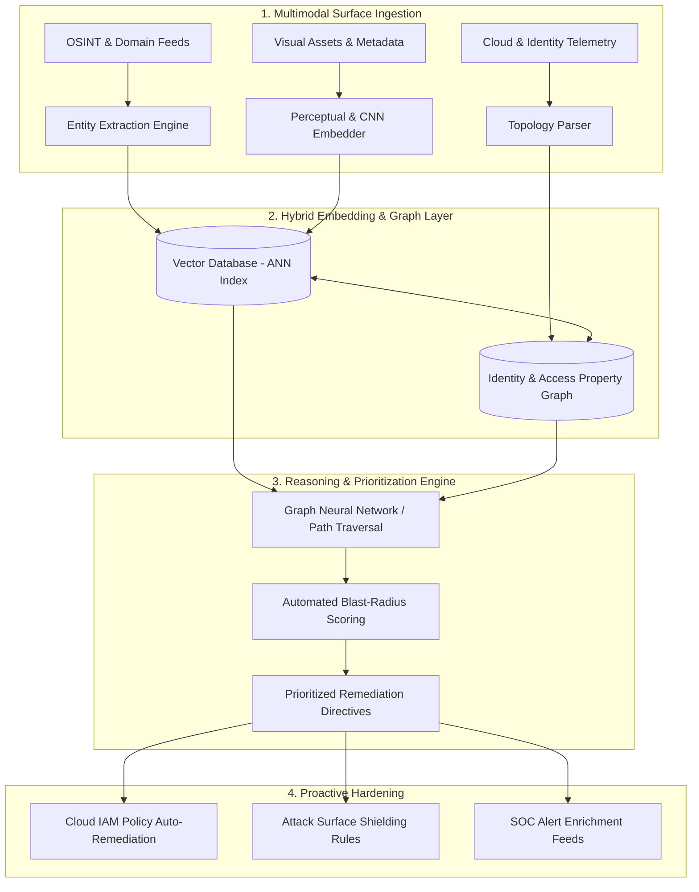

TITLE: AI-Driven Continuous Threat Exposure Management (CTEM) & Graph Embedding Engine
FILENAME: ai-driven-ctem-graph-embedding-engine.md
TAGS: [security-engineering, ctem, graph-rag, vector-embeddings, attack-surface-management, osint]
CONTENT:
---
title: "AI-Driven Continuous Threat Exposure Management & Graph Embedding Architecture"
created: 2026-10-01
type: engineering-blueprint
tags: [security-engineering, ctem, graph-rag, vector-embeddings, attack-surface-management, osint]
confidence: high
---

# 🌐 AI-Driven Continuous Threat Exposure Management & Graph Embedding Architecture

## Executive Summary
This architecture synthesizes high-dimensional multimodal vector representations (visual, textual, and geospatial embeddings) from [[ai-powered-offensive-security-and-osint-playbook]] with structural graph and attack-path enumeration principles from [[2026-10-01-thom-code-13-essential-hacking-tools-playbook]]. 

The result is an automated **Continuous Threat Exposure Management (CTEM)** engine that converts raw external surface data, cloud infrastructure topologies, and identity access pathways into a unified **Heterogeneous Exposure Knowledge Graph (HEKG)** powered by Vector Graph RAG.

---

## 🏛️ System Architecture

---

## 🔧 Core Functional Components

### 1. Multimodal Vectorization of Surface Telemetry
- **Visual & Brand Assets:** External assets are processed via perceptual hashing and dense visual embeddings to detect unauthorized brand cloning or exposed internal web UI assets indexed publicly.
- **Service & Infrastructure Signatures:** HTTP response headers, TLS certificate chains, and banner metadata are encoded into dense text embeddings (e.g., using specialized transformer models) to cluster exposed infrastructure into operational fingerprint classes.

### 2. Heterogeneous Identity & Topology Graph
- **Identity Relationships:** Ingests entity mappings (inspired by Active Directory and Cloud IAM path analysis tools like BloodHound and CloudFox).
- **Relational Triples:** Maps assets as nodes (`Asset`, `Identity`, `Role`, `Endpoint`) and relationships as typed edges (`CAN_ASSUME`, `EXPOSES`, `RESOLVES_TO`, `ADMINISTERS`).

### 3. Latent-Path Attack Surface Simulation
Instead of static vulnerability scanning, the engine projects topological paths through a combination of:
- **Graph Traversal:** Finding shortest paths from unauthenticated perimeter nodes to critical data stores or high-privilege administrative roles.
- **Semantic Similarity Querying:** Matching asset signatures against known exposure vectors using Approximate Nearest Neighbors (ANN) vector indices.

---

## 🚀 Step-by-Step Implementation Blueprint

### Phase 1: Ingestion & Normalization Pipeline
1. **Schema Standardization:** Define a unified entity-relationship schema using JSON-LD for mapping assets, DNS records, and IAM configurations.
2. **Batch & Stream Ingestion:** Ingest perimeter feeds and cloud asset inventories via event triggers into a central message queue.

### Phase 2: Knowledge Graph & Vector Store Integration
1. **Graph Layer Setup:** Deploy a property graph database (such as Neo4j or an open-source graph engine) to maintain identity permissions and topology relationships.
2. **Vector Index Setup:** Deploy an ANN vector index (e.g., Qdrant, Milvus, or pgvector) storing 512/768-dimensional embeddings of service banners, web responses, and metadata.
3. **Cross-Linking:** Store vector IDs as properties on graph nodes to enable unified **Graph-Vector Hybrid Queries**.

### Phase 3: Blast-Radius & Exposure Scoring
1. **Choke Point Analysis:** Calculate graph centrality metrics (Betweenness and Eigenvector centrality) across the IAM and network topology to identify critical identity bottlenecks.
2. **Risk Scoring Matrix:**
   $$\text{Exposure Score} = \text{Criticality}(\text{Target}) \times \text{Centrality}(\text{Choke Point}) \times \text{Reachability}(\text{Perimeter})$$
3. **Remediation Dispatch:** Output structured mitigation playbooks to infrastructure-as-code (IaC) repositories (e.g., automated Terraform pull requests to prune excessive IAM permissions).

---

## 🛡️ Verification & Continuous Validation

- **Automated Validation:** Integrate exposure path evaluations into CI/CD pipelines to verify that newly deployed infrastructure does not introduce transitive exposure paths to sensitive data.
- **Telemetry Verification:** Compare graph projections with real-time SIEM and VPC flow logs to ensure discovered paths match actual network reachable zones.